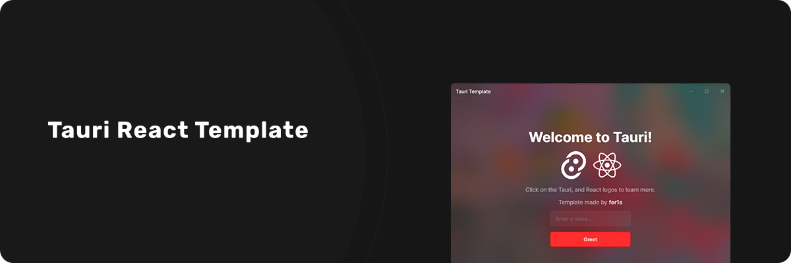
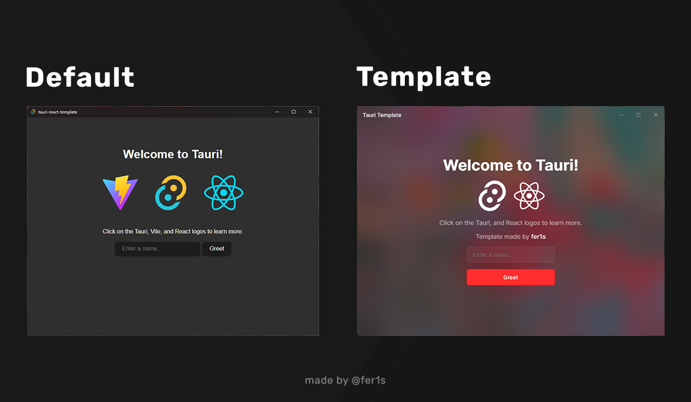

# Tauri React Template



This template should help get you started developing with Tauri, React and Typescript in Vite. (Tested on Win 11)

## Preview



## Development

1. Clone repository
```bash
$ git clone https://github.com/fer1s/tauri-react-template ./my-app
$ cd my-app
```

2. Install dependencies
```bash
$ pnpm install
```

3. Run
```bash
$ pnpm tauri dev
```

## Recommended IDE Setup

- [VS Code](https://code.visualstudio.com/) + [Tauri](https://marketplace.visualstudio.com/items?itemName=tauri-apps.tauri-vscode) + [rust-analyzer](https://marketplace.visualstudio.com/items?itemName=rust-lang.rust-analyzer)
